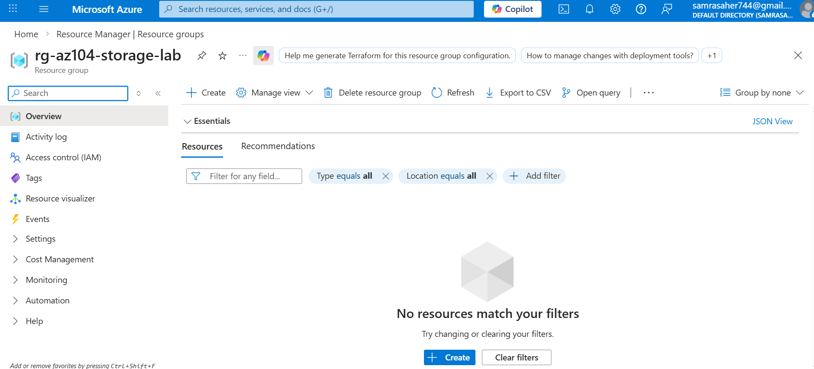
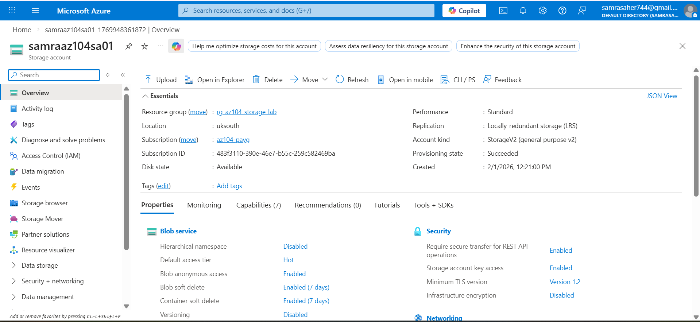
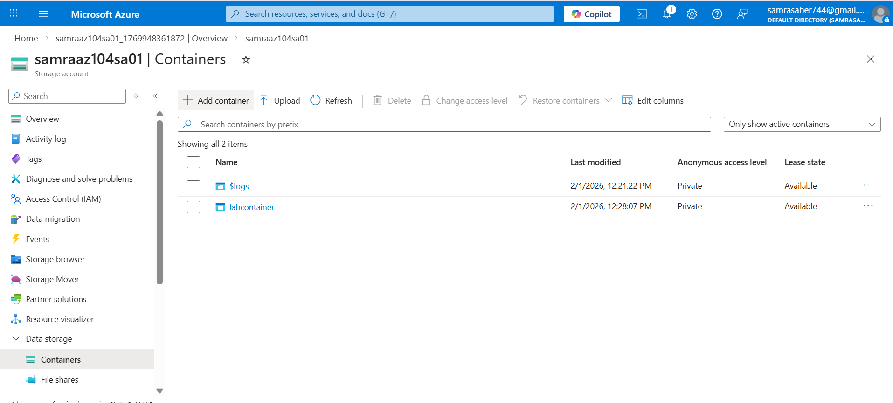
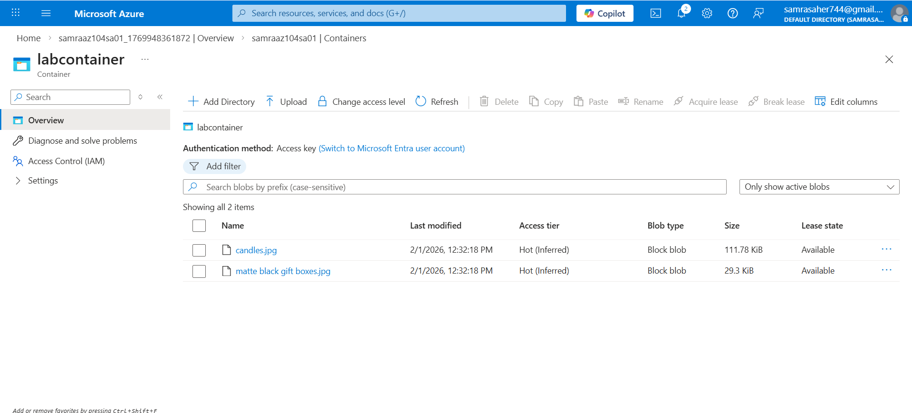
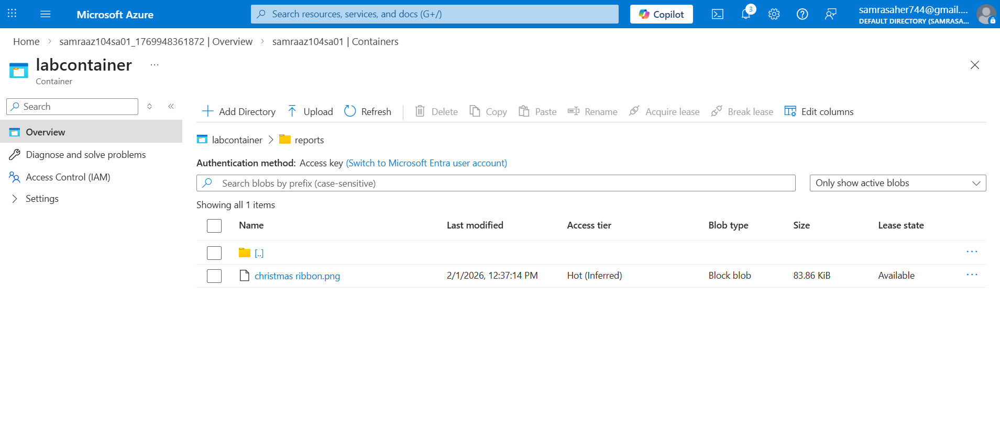
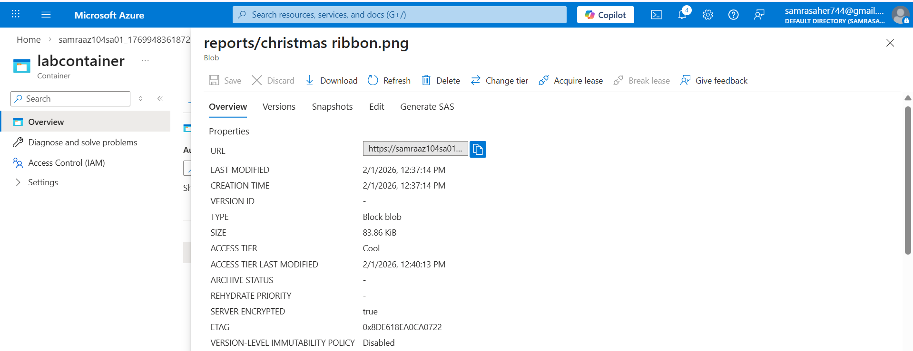
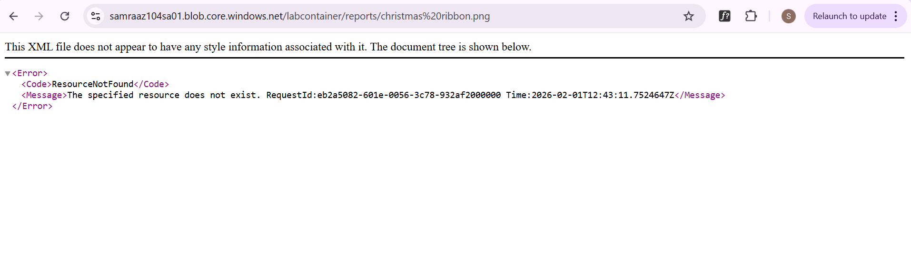

# Lab 1 – Azure Blob Storage (AZ-104)

This lab demonstrates how to create and manage Azure Blob Storage using the Azure Portal.

---

## 🎯 Lab Objectives

- Create a resource group for storage
- Create a Storage Account (GPv2)
- Configure redundancy and region
- Create blob containers
- Upload blobs
- Create virtual directories
- Change blob access tiers
- Verify private access behavior

---

## 🧪 Lab Tasks Performed

### 1️⃣ Resource Group Creation
- Created a dedicated resource group for storage labs.

### 2️⃣ Storage Account Creation
- Created a General Purpose v2 (StorageV2) account.
- Region: UK South
- Performance: Standard
- Redundancy: LRS

### 3️⃣ Container Creation
- Created private blob containers.
- Verified anonymous access is disabled.

### 4️⃣ Blob Upload
- Uploaded image files as block blobs.

### 5️⃣ Virtual Directory Structure
- Created a logical folder structure inside the container.

### 6️⃣ Blob Access Tier Management
- Changed blob access tier from Hot to Cool.

### 7️⃣ Access Verification
- Attempted direct public URL access.
- Verified private access restriction.

---

## 📸 Screenshots

### 1️⃣ Resource Group Created

---

### 2️⃣ Storage Account Overview

---

### 3️⃣ Private Blob Container Created

---

### 4️⃣ Blobs Uploaded

---

### 5️⃣ Virtual Directory Created

---

### 6️⃣ Blob Access Tier Changed

---

### 7️⃣ Private Access Test (Expected Failure)

---

## ✅ Result

Successfully configured Azure Blob Storage with private access and validated storage behavior according to AZ-104 exam requirements.
