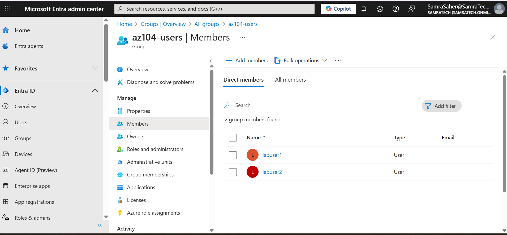
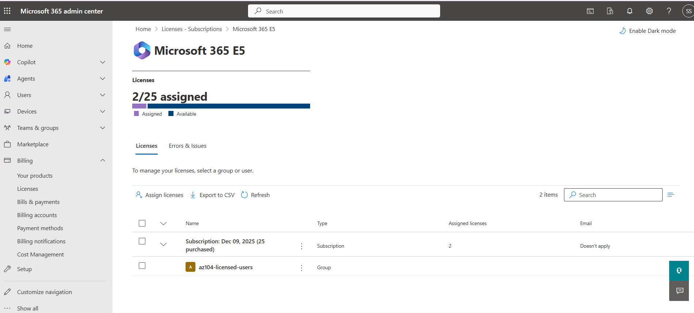
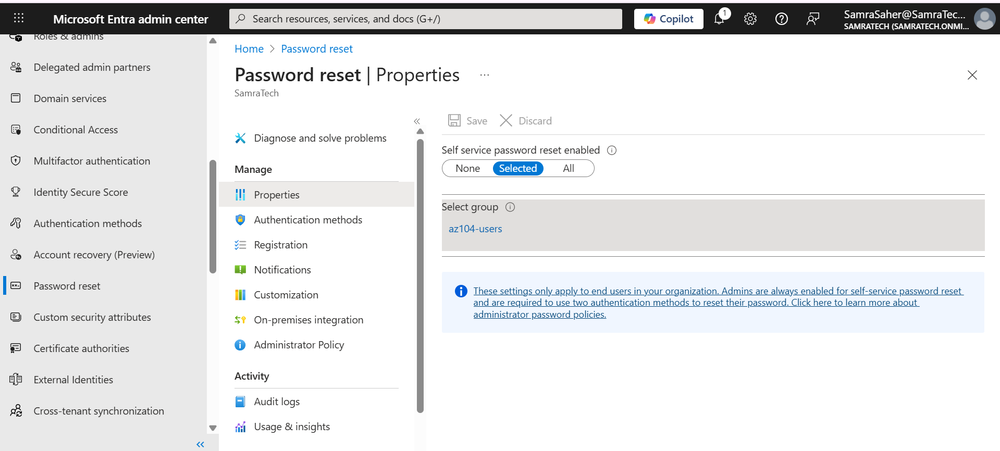

# AZ-104 – Identity and Governance (Microsoft Entra ID)

This lab covers **Manage Azure identities and governance** from the AZ-104 exam.

## 🔹 Objectives
- Create and manage Microsoft Entra users and groups
- Assign licenses using group-based licensing
- Configure Self-Service Password Reset (SSPR)
- Manage external (guest) users

---

## 🔹 Lab Tasks Performed

### 1. User Management
- Created cloud users for lab testing
- Verified user list in Microsoft Entra ID

---

### 2. Group Management
- Created security groups for AZ-104 labs
- Added users to groups

---

### 3. Group-Based License Assignment
- Assigned Microsoft 365 E5 license to a security group
- Configured group-based licensing and confirmed assignment at the group level

---

### 4. External (Guest) User
- Added a guest user to Microsoft Entra ID
- Verified guest user type and properties

---

### 5. Self-Service Password Reset (SSPR)
- Enabled SSPR for selected users
- Configured Self-Service Password Reset (SSPR) policies and authentication methods

---

## ✅ AZ-104 Skills Demonstrated
- Microsoft Entra ID user and group management
- Group-based licensing
- External user access
- Identity security configuration (SSPR)
